# Session-Management

I recently completed the Session Management course on TryHackMe , where I learned about the Session Management Lifecycle, including key phases like Session Creation, Tracking, Timeout, and Termination. I acquired knowledge of Cookie-based and Token-based Session Management methods. I also gained a deeper understanding of the importance of session management security in protecting user data and preventing unauthorized access.

## Task2 Correct Answer
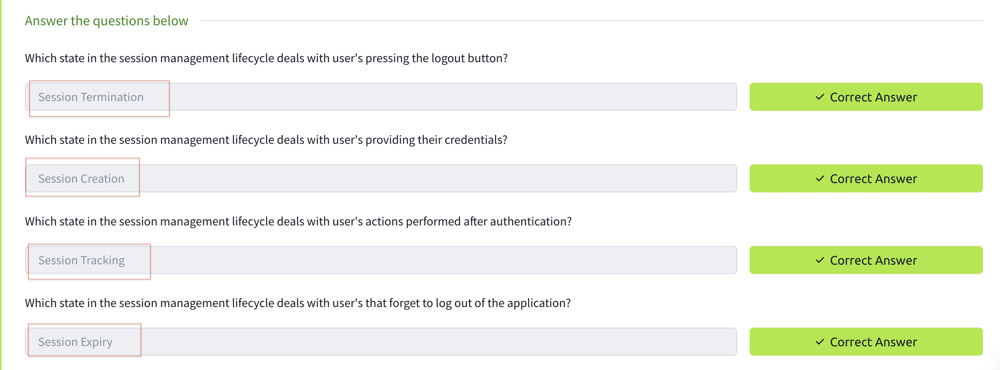

## Task3 Correct Answer
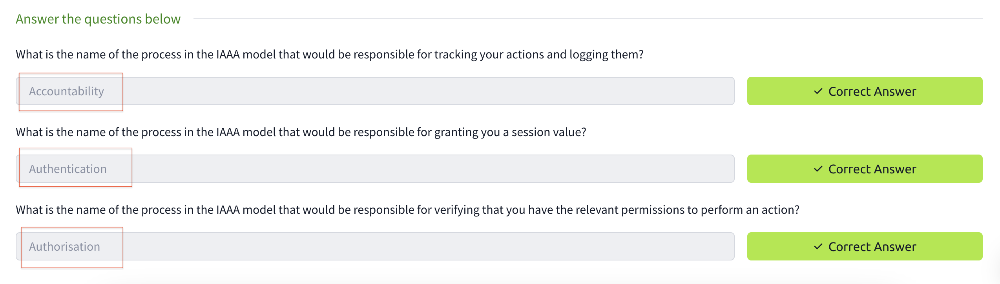

## Task4-1-2-3
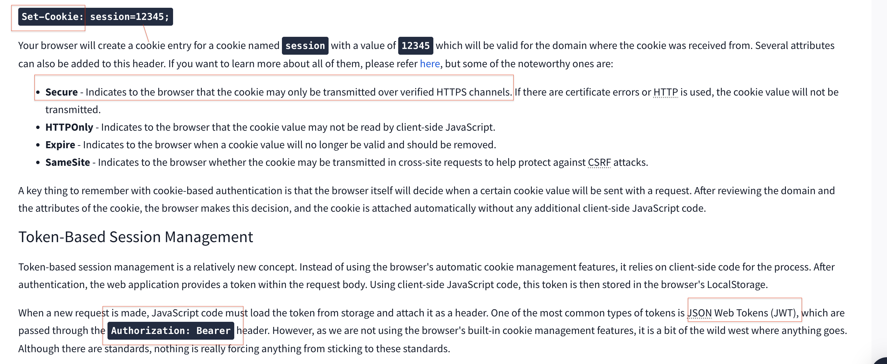

## Task4 Correct Answer
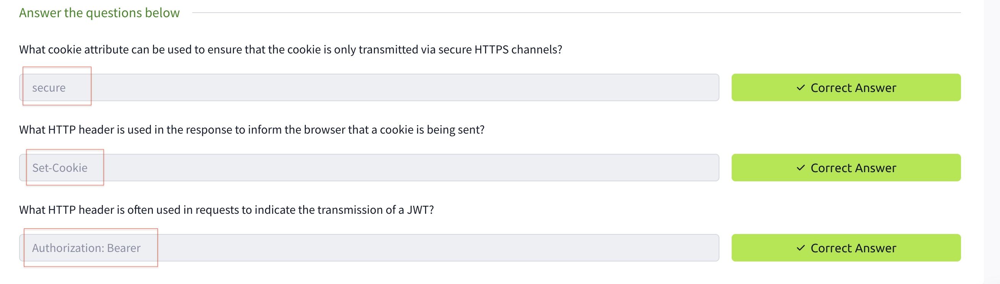

## Task5 Correct Answer
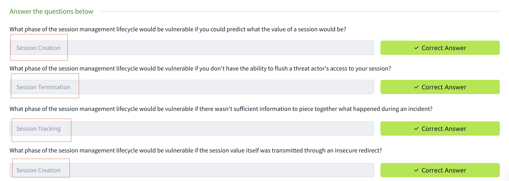

## Task6-1
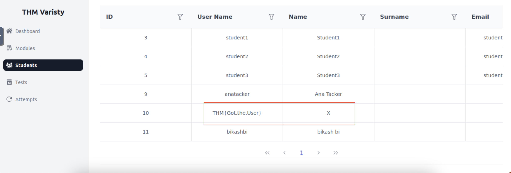

## Task6-2
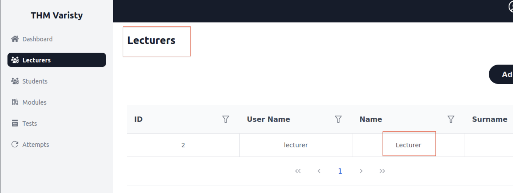

## Task6-4

## Task6-5
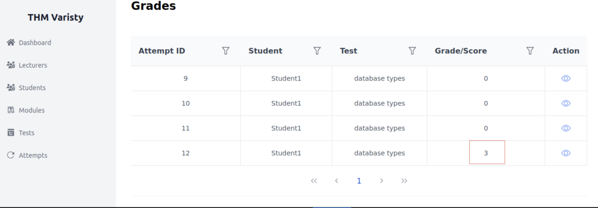

## Task6-6
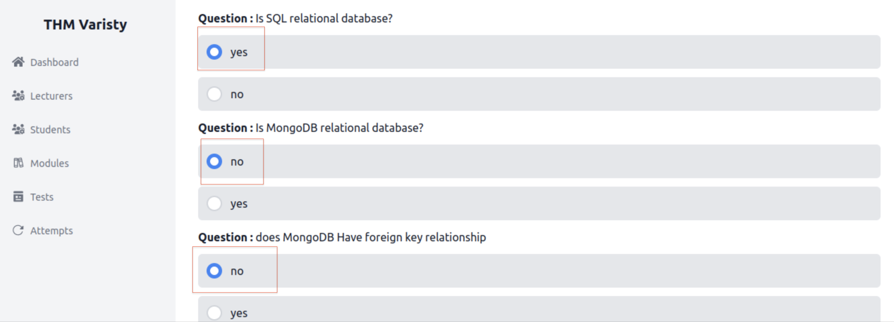

## Task6 Correct Answer
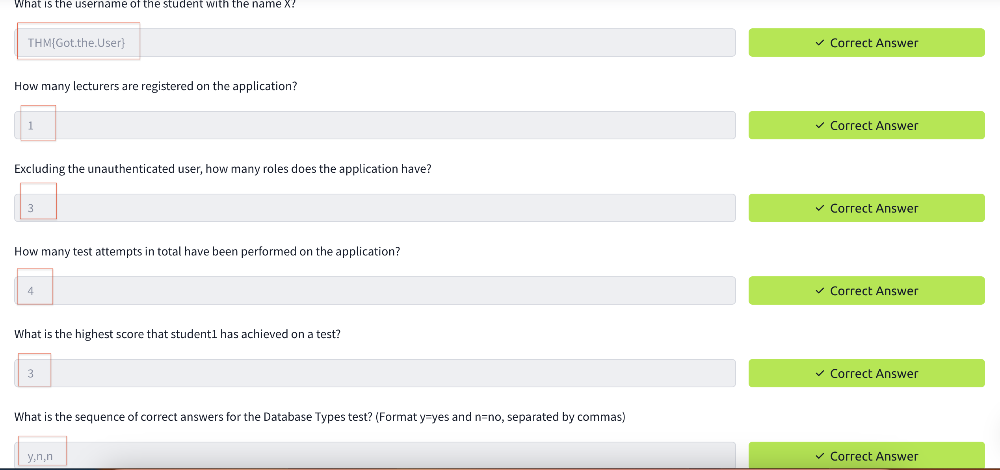

## All Task Completed
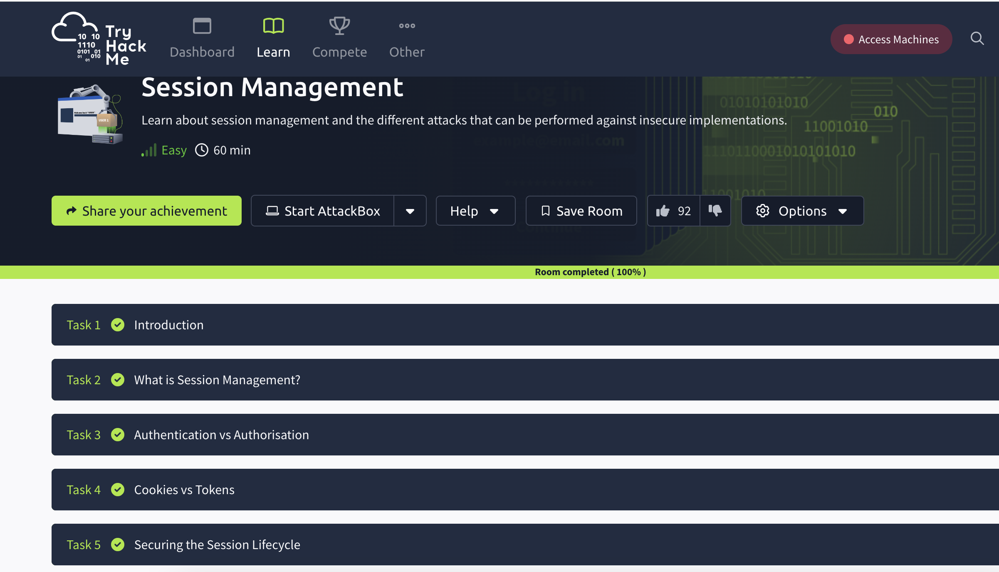
